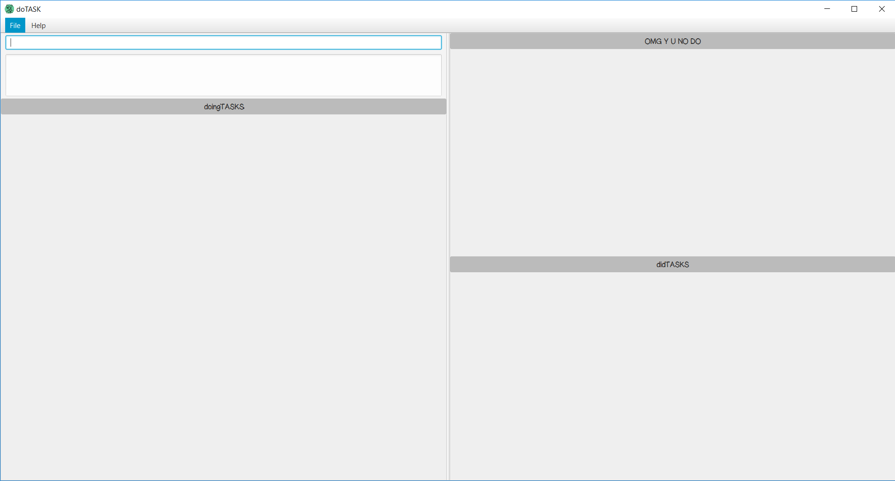
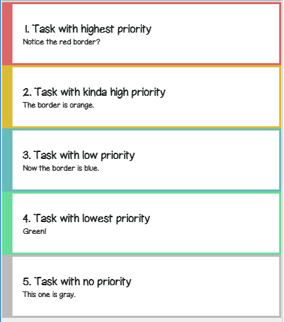

# doTASK - User Guide

By : `Miao Ling` , `Ian` , `Qi Xiang` and `Dylan` - `[W09-B4]` Since : `Feb 2017`

---

1. [Introduction](#1-introduction)
2. [Quick Start](#2-quick-start)
3. [Features](#3-features)
> 3.1. [Viewing Help](#31-viewing-help-help) 
> 3.2. [Adding a task](#32-adding-a-task-add) 
> 3.3. [Listing the tasks](#33-listing-the-tasks-list) 
> 3.4. [Editing a task](#34-editing-a-task-edit) 
> 3.5. [Deleting a task](#35-deleting-a-task-delete) 
> 3.6. [Completing a task](#36-completing-a-task-complete) 
> 3.7. [Uncompleting a task](#37-uncompleting-a-task-uncomplete) 
> 3.8. [Deleting a completed task](#38-deleting-a-completed-task-deletecompleted) 
> 3.9. [Searching for tasks](#39-searching-for-tasks-find) 
> 3.10. [Searching for tags](#310-searching-for-tags-findtag) 
> 3.11. [Finding high priority tasks](#311-finding-high-priority-tasks-important) 
> 3.12. [Finding upcoming tasks](#312-finding-upcoming-tasks-upcoming) 
> 3.13. [Finding overdue tasks](#313-finding-overdue-tasks-overdue) 
> 3.14. [Undo-ing previous action](#314-undo-ing-previous-action-undo) 
> 3.15. [Redo-ing previous action](#315-redo-ing-previous-action-redo) 
> 3.16. [Get previous command](#316-get-previous-command-) 
> 3.17. [Get next command](#317-get-next-command-) 
> 3.18. [Clearing the task manager](#318-clearing-the-task-manager-clear) 
> 3.19. [Saving the task manager](#319-saving-the-task-manager-save) 
4. [FAQ](#4-faq)
5. [Command Summary](#5-command-summary)

## 1. Introduction

Our application doTASK helps to improve your productivity and accountability in managing your daily activities. The main feature of our application is its
prioritisation framework, which lets you focus on the important things. This user guide will provide you with the basic information you'll need in setting
up doTASK, as well as guide you on how to use it to make you more efficient in prioritising your tasks.

## 2. Quick Start

1. Ensure you have Java version `1.8.0_60` or later installed in your Computer.

2. Download the latest version of `doTASK.jar` from [releases] tab.

3. Copy the file to the folder you want to use as the home folder for your doTASK.

4. Double-click on the file to start the application. The GUI should appear in a few seconds. 
> 

5. Get started by adding your first task that you have in mind! Refer to **3. Features** for further instructions. 

## 3. Features

> Command Format
>
> * Items in `UPPER_CASE` are the parameters.
> * Items in `SQUARE_BRACKETS` are optional.
> * Items with `...` after them can have multiple instances.
> * Parameters can be in any order.

### 3.1. Viewing help: `help`
Allows you to view the list of commands available in doTASK via the user guide.  
Format: `help`

### 3.2. Adding a task: `add`
There are a total of 5 parameters : `TASK_NAME` , `PRIORITY_LEVEL` , `DEADLINE` , `INFORMATION`, `TAGS`. 
> `taskname` is mandatory. The rest of the parameters are optional. 
> User can add a task with any of the optional parameters, mentioned from [3.2.2](#322-adds-a-task-with-priority_level-) - [3.2.5](#325-adds-a-task-with-tags).

#### 3.2.1. Adds a floating task. 
> * Floating tasks are tasks that excludes other parameters. Priority level, deadline, information and taggings are excluded.  
Format: `add TASK_NAME`

Example:
> I want to buy a packet of milk. 
* add Buy Milk

#### 3.2.2. Adds a task with `PRIORITY_LEVEL`.  
Format: `add TASK_NAME [p/PRIORITY_LEVEL]` 
`PRIORITY_LEVEL` should be defined by integers 1 (high) to 4 (low). 

Tasks will be colour-coded based on its priority level.
  > 

Example:
> I want to buy a packet of milk. Highest priority as it is urgent. 
* add Buy Milk p/1

#### 3.2.3. Adds a task with `DEADLINE`.  
Format: `add TASK_NAME [d/DEADLINE]` 
`DEADLINE` can be keyed in various methods. The user should read the following guidelines before moving on. 
   > * `DEADLINE` should be entered in the format of "date month", "month date", "date month year" or "month date year".  
   > * If no year is specified, the current year of the system will be used as the year of the deadline. 
   > * The month should be spelled out either in full or with the general 3 letter naming convention. 
   > * There are abbreviated forms allowed, such as today/tomorrow/this monday. 
   > * Tasks with deadlines will be complemented with reminders, so you won't forget to do them!

Examples:
> I want to buy a packet of milk by 17 March 2017.
* add Buy Milk d/17 Mar 2017
> I am heading to Japan from 18 March 2017 to 30 March 2017
* add Japan trip d/18 mar 2017 to 30 mar 2017

#### 3.2.4. Adds a task with `INFORMATION`. 
Format: `add TASK_NAME [i/INFORMATION]` 
 `INFORMATION` refers to the details of the task. 

Examples:
> I want to buy a packet of milk, HL brand 1.5 Litres. 
* add Buy Milk i/HL Milk 1.5 Litres

#### 3.2.5. Adds a task with `TAGS`. 
Format: `add TASK_NAME [t/TAGS]` 
`TAGS` refers to the tags of the task. 

Examples:
> I want to buy a packet of milk for home usage. 
* add Buy Milk t/home

### 3.3. Listing the tasks: `list`

Shows a list of all the tasks in the task manager. 
Format: `list`

### 3.4. Editing a task: `edit`
Edits an existing task in the task manager. 
Format: `edit i/INDEX [n/TASK_NAME] [d/DEADLINE] [p/PRIORITY_LEVEL] [i/ANY_INFO] [t/TAGS]...`

> * Edits the task as denoted by the `INDEX` digit as shown on the screen. The `INDEX` must be a positive integer, e.g. 1, 2, 3, ...
> * The index of a task can be found beside the task description.
> * At least **one** of the optional [fields] must be provided.
> * Existing fields will be overwritten.

Examples:
* `edit i/1 n/Assignment 2 d/25 Feb 2018 p/2`
* `edit i/4 n/Exercise`

### 3.5. Deleting a task: `delete`
Deletes the specified task in the "doingTASKS" list. 
Format: `delete INDEX_NUMBER`

> The task labelled `INDEX_NUMBER` will be deleted from the "doingTASKS" list. 
> `INDEX_NUMBER` of tasks is shown according to the current tab.

Examples:
* `delete 2`
* `delete 5`

### 3.6. Completing a task: `complete`

Marks the specified task in the "doingTASKS" list as complete. 
Format: `complete INDEX_NUMBER`
> `INDEX_NUMBER` of tasks is shown according to the "doingTASKS" list. 
> The task labelled by `INDEX_NUMBER` in the "doingTASKS" list will be marked as completed. 
> The completed task will be moved over to the "didTASKS" list.

Example:
* `complete 2`
> The task indicated by index number 2 in the "doingTASKS" list section will be marked as completed and shifted over the the "didTASKS" list section.

### 3.7 Uncompleting a task: `uncomplete`

Marks the specified task in the "didTASKS" list as uncomplete. 
Format: `uncomplete INDEX_NUMER`
> `INDEX_NUMBER` of tasks is shown according to the "didTASKS" list. 
> The task labelled by `INDEX_NUMBER` in the "didTASKS" list will be marked as uncompleted. 
> The specified task will be moved over to the "doingTASKS" list.

Example:
* `uncomplete 2`
> The task indicated by index number 2 in the "didTASKS" list section will be marked as completed and shifted over the the "doingTASKS" list section.

### 3.8 Deleting a completed task: `deletecompleted`

Permanently removes the completed task from the completed task list. 
Format: `deletecompleted INDEX_NUMBER`
> `INDEX_NUMBER` of tasks is shown according to the "didTASKS" list. 
> The task labelled by `INDEX_NUMBER` in the "didTASKS" list will be permanently removed from the task manager. 

Example:
* `deletecompleted 1`
> The task indicated by index number 1 in the "didTASKS" list section will be permanently deleted.

### 3.9. Searching for tasks: `find`

Searches for tasks based on the keywords that you specify. 
Format: `find KEYWORD`
> No special characters such as ASCII whitespace is allowed. 
> There will be a list of tasks shown that contains the stated `KEYWORD`.
> In cases whereby user forgets the exact `KEYWORD`, or makes typographical errors, doTASK will generate a near match search.

Examples: 
> User wants to find a task with presentation in the task name (there exists a task with task name : presentation). 
* `find presentation`
> User doesn't sure of the exact task name. 
* `find present`
> User accidentally typed an extra character, or missing a character. 
* `find presentations`
> User accidentally swapped two characters during typing. 
* `find presentatoin`

### 3.10. Searching for tags: `findtag`

Searches for tasks with the specified tag. 
Format: `findtag TAGS`

Examples: 
> User wants to find the tasks tagged with `School`. 
* `findtag School`

### 3.11. Finding high priority tasks: `important`

Searches for tasks based on the highest priority level (1). 
Format: `important`

### 3.12. Finding upcoming tasks: `upcoming`

Searches for tasks that need to be completed within the next 24 hours. 
Format: `upcoming`
> Events which fall within the time period will also be displayed.

### 3.13. Finding overdue tasks: `overdue`

Searches for tasks that have not been completed by the given deadline. 
Format: `overdue`

### 3.14. Undo-ing previous action: `undo`

Reverses previous action that you've made. 
Format: `undo`
> The command last executed will be reversed.
> Only 1 command will be reversed at a time.

### 3.15. Redo-ing previous action: `redo`

Reverses previous `undo` that you've made. 
Format: `redo`
> Any previous `undo` will be reversed, in successive order.

### 3.16. Get previous command: <kbd>↑</kbd>

Retrieve the previous command entered, and replaces your text field with the previous command. 
Format: Up arrow key
> You can retrieve earlier commands from your use session by pressing <kbd>↑</kbd> again and again.

### 3.17. Get next command: <kbd>↓</kbd>

Retrieve the next command entered, and replaces your text field with the next command. 
Format: Down arrow key
> You can retrieve later commands from your use session by pressing <kbd>↓</kbd> again and again.

### 3.18. Clearing the task manager: `clear`

Clears the in-app memory of the task manager. 
Format: `clear`
> You can undo a clear command if it was accidentally keyed in.

### 3.19. Saving the task manager: `save`

Saves the task manager data to the .xml file specified by you. 
Format: `save PATH_TO_FILE/FILE_NAME.xml`
> Your file name must have the extension `.xml`. 
> If you did not specify a path, the default path is `data/taskManager.xml`. 
> Do not delete the saved xml file or modify it as it may result in a complete loss of data that cannot be recovered by the application itself. 
> The path specified can either be a relative path or an absolute path.
> * A relative path is relative to the directory that your `doTASK.jar` file is in. 
> * An absolute path specifies the root directory, and usually includes the C:\ or D:\ drive. 
>
> Refer below for examples of relative and absolute paths.

Examples:
* `save todo/myTasks.xml`
* `save C:\Users\jimlim\Documents\todo.xml`

## 4. FAQ

**Q**: How do I save my data in doTASK? 
**A**: Your data is automatically saved every time you do something that modifies it (e.g. adding, editing, deleting tasks). If you would like to save your data to a specific directory, use the [save command](#313-saving-the-task-manager-save).

**Q**: How do I transfer my data to another computer? 
**A**: Install the application in the other computer and overwrite the empty data file with the file <file_name.xml> that contains the data of your current doTASK manager.

**Q**: How do I load my data from an xml file to doTASK? 
**A**: Save doTASK to any location you like using the [save command](#313-saving-the-task-manager-save). Locate the save file, and overwrite it with your own xml file. Restart doTASK, and your data should be loaded.

**Q**: How will I know if the deadlines of tasks are nearing? 
**A**: For tasks that are due soon, there will be a notification in the system tray reminding you of the task. The system tray notification will remind you of tasks that are due in **3 hours**.

## 5. Command Summary

* **Help** : `help`

* **Add** : `add TASK_NAME [d/DEADLINE] [p/PRIORITY_LEVEL] [i/ANY_INFO] [t/TAGS]...` 
	e.g. `add Sleep d/27 December 2018 p/1 i/Sleep is good t/Home`

* **List All** : `list`

* **Edit** : `edit` 
	e.g. `edit i/3 n/Buy a house`

* **Delete an uncompleted task** : `delete` 
	e.g. `delete 1`

* **Complete a task** : `complete` 
	e.g. `complete 1`

* **Uncomplete a task** : `uncomplete` 
	e.g. `uncomplete 1`

* **Delete a completed task** : `deletecompleted` 
	e.g. `deletecompleted 1`

* **Find tasks containing KEYWORD** : `find KEYWORD` 
	e.g. `find potato`

* **Find tasks related to tag** : `findtag` 
	e.g. `findtag Work`

* **Finding high priority tasks** : `important` 

* **Finding upcoming tasks** : `upcoming` 

* **Finding overdue tasks** : `overdue` 

* **Undo previous action** : `undo` 

* **Redo previous action** : `redo` 

* **Get previous command** : <kbd>↑</kbd> 

* **Get next command** : <kbd>↓</kbd> 

* **Clear task manager** : `clear`

* **Save data to file** : `save PATH_TO_FILE/FILE_NAME.xml` 
